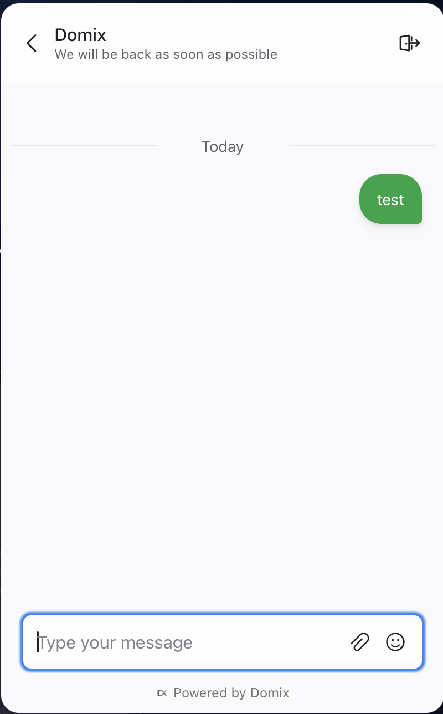

<h1>
domix-ai-react-native-widget
</h1>


[](http://makeapullrequest.com)


- **Supported Domix AI version:** 1.0.0+



### Installation

Install the library using either yarn or npm like so:

```sh
yarn add domix-ai-react-native-widget
```

OR

```sh
npm install --save domix-ai-react-native-widget
```

This library depends on [react-native-webview](https://www.npmjs.com/package/react-native-webview) and [async-storage](https://github.com/react-native-async-storage/async-storage). Please follow the instructions provided in the docs.

### iOS Installation

If you're using React Native versions > 60.0, it's relatively straightforward.

```sh
cd ios && pod install
```

### How to use

1. Create a website channel in Domix AI server.
2. Replace `websiteToken`.

```javascript
import React, { useState } from 'react';

import { StyleSheet, View, SafeAreaView, TouchableOpacity, Text } from 'react-native';

import DomixAIWidget from 'domix-ai-react-native-widget';

const App = () => {
  const [showWidget, toggleWidget] = useState(false);
  const user = {
    identifier: 'john@gmail.com',
    name: 'John Samuel',
    avatar_url: '',
    email: 'john@gmail.com',
    identifier_hash: '',
  };
  const customAttributes = { accountId: 1, pricingPlan: 'paid', status: 'active' };
  const conversationCustomAttributes = { orderId: 1234, status: 'pending' };
  const websiteToken = 'WEBSITE_TOKEN';
  const baseUrl = 'https://chat.domix.ai';
  const locale = 'en';
  const colorScheme = 'dark';

  return (
    <SafeAreaView style={styles.container}>
      <View>
        <TouchableOpacity style={styles.button} onPress={() => toggleWidget(true)}>
          <Text style={styles.buttonText}>Open widget</Text>
        </TouchableOpacity>
      </View>
      {showWidget && (
        <DomixAIWidget
          websiteToken={websiteToken}
          locale={locale}
          baseUrl={baseUrl}
          closeModal={() => toggleWidget(false)}
          isModalVisible={showWidget}
          user={user}
          customAttributes={customAttributes}
          conversationCustomAttributes={conversationCustomAttributes}
          colorScheme={colorScheme}
        />
      )}
    </SafeAreaView>
  );
};

const styles = StyleSheet.create({
  container: {
    flex: 1,
    justifyContent: 'center',
    alignItems: 'center',
  },

  button: {
    height: 48,
    marginTop: 32,
    paddingTop: 8,
    paddingBottom: 8,
    backgroundColor: '#1F93FF',
    borderRadius: 8,
    borderWidth: 1,
    borderColor: '#fff',
    justifyContent: 'center',
  },
  buttonText: {
    color: '#fff',
    textAlign: 'center',
    paddingLeft: 10,
    fontWeight: '600',
    fontSize: 16,
    paddingRight: 10,
  },
});

export default App;
```

You're done!

The whole example is in the `/Example` folder.

### Props

<table class="table">
<thead><tr>
  <th>Name</th><th>Default</th><th>Type</th><th>Description</th>
</tr></thead>
<tbody>
  <tr>
    <td>baseUrl</td>
    <td> - </td>
    <td> String </td>
    <td>Domix AI installation URL</td>
  </tr>
 <tr>
    <td>websiteToken</td>
    <td> - </td>
    <td> String </td>
    <td>Website channel token</td>
  </tr>
  <tr>
    <td>colorScheme</td>
    <td> light </td>
    <td> String </td>
    <td>Widget color scheme (light/dark/auto)</td>
  </tr>
   <tr>
    <td>locale</td>
    <td> en </td>
    <td> String </td>
    <td>Locale</td>
  </tr>
  <tr>
    <td>isModalVisible</td>
    <td> false </td>
    <td> Boolean </td>
    <td>Widget is visible or not</td>
  </tr>
    <tr>
    <td>closeModal</td>
    <td> - </td>
    <td> Function </td>
    <td>Close event</td>
  </tr>
  <tr>
	  <td>user</td>
    <td> {} </td>
    <td> Object </td>
    <td>User information about the user like email, username and avatar_url</td>
  </tr>
  <tr>
   <td>customAttributes</td>
    <td> {} </td>
    <td> Object </td>
    <td>Additional information about the customer (Contact)</td>
  </tr>
  <tr>
   <td>conversationCustomAttributes</td>
    <td> {} </td>
    <td> Object </td>
    <td>Additional information about the conversation</td>
  </tr>
 </tbody>
</table>

## Feedback & Contributing

Feel free to send us feedback.

_Domix AI_ &copy; 2026, Domix AI - Released under the MIT License.
